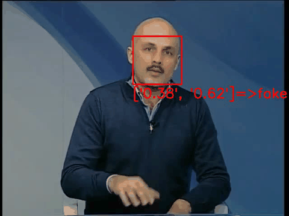

# DeepFake Detector

A face-level deepfake detection pipeline trained on **Celeb-DF v2**. It fine-tunes an **EfficientNet-B0** binary classifier on MTCNN-cropped face frames and ships a Flask web app that lets you upload a video, runs frame-by-frame inference, overlays REAL/FAKE labels on the video, and reports an aggregate verdict.

> Note: some filenames/strings (`train_celebdf_xception.py`, the page title "XceptionNet") reference the project's original Xception backbone. The model was later switched to **EfficientNet-B0**; the naming just wasn't updated.

## Demo



## How it works

1. **`data_create.py`** — downloads the Celeb-DF v2 dataset from Kaggle Hub (`reubensuju/celeb-df-v2`).
2. **`extract_frames.py`** — for every video in `Celeb-real`, `YouTube-real`, and `Celeb-synthesis`, uses **MTCNN** (`facenet-pytorch`) to detect and crop 2 face frames (first frame + middle frame) and saves them as JPEGs under a `frames/` directory.
3. **`prepare_celebdf_list.py`** — builds train/val/test split text files (`data_list/celebdf_{train,val,test}.txt`), each line being `<frame_path> <label>` (0 = real, 1 = fake). Splitting is done **by video** (not by frame) to avoid leakage, and the official Celeb-DF test list is respected. Dataset size is capped via `MAX_VIDEOS_PER_CLASS`.
4. **`train_celebdf_xception.py`** — fine-tunes `torchvision.models.efficientnet_b0` (ImageNet weights) with a replaced binary classification head. Freezes the first half of the feature layers, uses weighted `BCEWithLogitsLoss`, AMP mixed precision, and saves the best checkpoint to `output/best_model.pth` based on validation accuracy.
5. **`testing.py`** — evaluates the trained model on the held-out test split, aggregating frame-level probabilities to **video-level** predictions (mean pooling), then reports accuracy, ROC-AUC, a confusion matrix at threshold 0.5, and a scan for the best accuracy threshold.
6. **`app.py`** — a Flask app for interactive inference. Uploads a video, runs MTCNN + the trained EfficientNet-B0 on every 5th frame (`FRAME_SKIP`), overlays a REAL/FAKE label and confidence per sampled frame, re-encodes the output to browser-compatible H.264 via `ffmpeg`, and renders a verdict + fake/real frame percentages in `templates/index.html`.

## Requirements

- Python 3.10+ (project was pinned to CUDA 12.1 wheels of PyTorch — see `requirements.txt`)
- **`ffmpeg`** available on your `PATH` (required by `app.py` to re-encode annotated output for browser playback)
- An NVIDIA GPU + CUDA is strongly recommended for training/extraction, though everything falls back to CPU (`torch.device("cuda" if torch.cuda.is_available() else "cpu")`)
- A [Kaggle account](https://www.kaggle.com/) configured for `kagglehub` if you want to download the dataset yourself (`data_create.py`)

`requirements.txt` currently has several duplicated/superseded dependency blocks (leftover from iterative `pip freeze` exports) — if you hit resolver conflicts, install the latest block near the end of the file, or regenerate it fresh with `pip install -r requirements.txt --upgrade`.

## Setup

```bash
# Linux / macOS
python3 -m venv venv
source venv/bin/activate

# Windows
python -m venv venv
venv\Scripts\activate

pip install -r requirements.txt
```

## Building the model yourself

Run these in order from the project root:

```bash
python data_create.py              # download Celeb-DF v2 via kagglehub
python extract_frames.py           # MTCNN face-crop extraction -> frames/
python prepare_celebdf_list.py     # build train/val/test split lists -> data_list/
python train_celebdf_xception.py   # fine-tune EfficientNet-B0 -> output/best_model.pth
python testing.py                  # evaluate on the held-out test set
```

Useful flags (all scripts use `argparse` with sensible defaults):

- `extract_frames.py --dataset_root ./celebdf --frames_root ./frames`
- `prepare_celebdf_list.py --dataset_root ./celebdf --frames_root ./frames --output_dir ./data_list --val_split 0.1`
- `train_celebdf_xception.py --train_list ./data_list/celebdf_train.txt --val_list ./data_list/celebdf_val.txt --epochs 20 --batch_size 16 --lr 1e-4 --output_dir ./output`

A pretrained checkpoint is already included at [output/best_model.pth](output/best_model.pth), so the training steps above are optional if you just want to run the app.

## Running the web app

```bash
python app.py
```

Then open **http://127.0.0.1:5000**, upload a video (`.mp4`, `.avi`, `.mov`, `.mkv`), and click **Run Analysis**. The app will:

- Sample every 5th frame (`FRAME_SKIP = 5`)
- Run MTCNN face detection + EfficientNet-B0 classification (`THRESHOLD = 0.11` sigmoid probability for "FAKE")
- Draw a REAL/FAKE label + confidence on each processed frame
- Re-encode the output with `ffmpeg` for browser playback
- Show the verdict, fake/real frame percentages, and the annotated video inline

Uploaded videos are saved to `uploads/`, processed/annotated output to `processed/` (both created automatically).

## Project structure

```
app.py                        Flask web app for interactive inference
data_create.py                Downloads Celeb-DF v2 via kagglehub
extract_frames.py             MTCNN face-crop extraction from raw videos
prepare_celebdf_list.py       Builds train/val/test split lists
train_celebdf_xception.py     Trains the EfficientNet-B0 classifier
testing.py                    Video-level evaluation (accuracy, AUC, confusion matrix)
templates/index.html          Web UI (upload form + results)
output/best_model.pth         Pretrained model checkpoint
videos/                       Sample test videos
requirements.txt              Python dependencies
```
